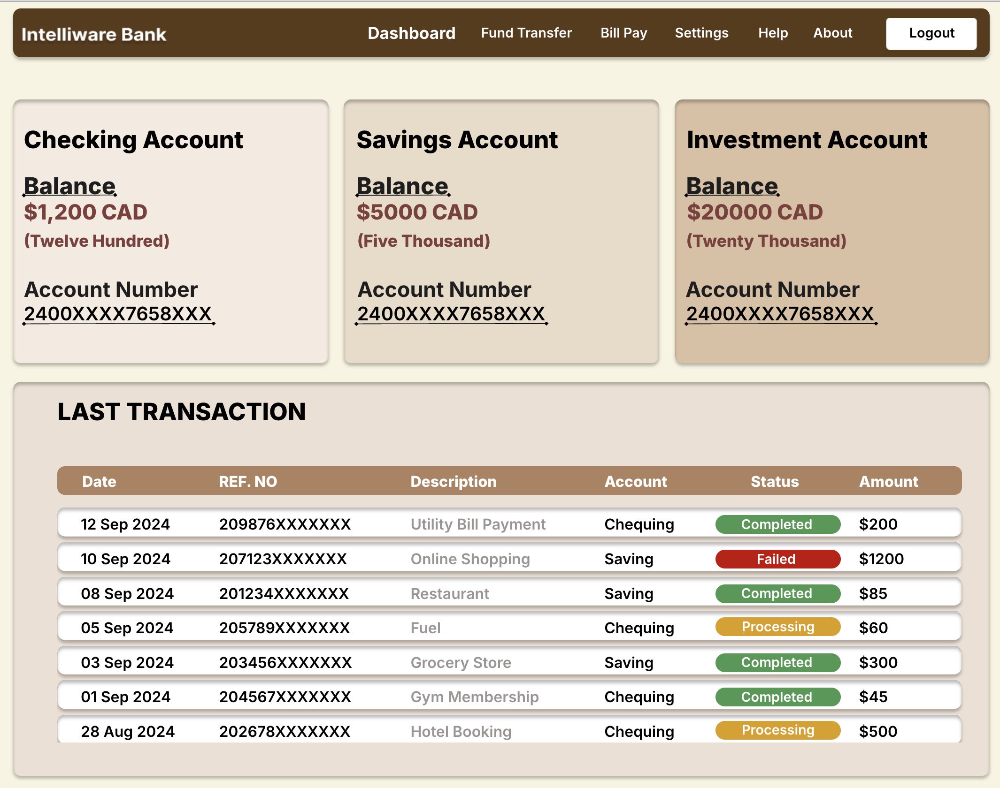

# Building a Minimalist Financial Dashboard

## Project Description

This project focuses on building one of the core components of a financial dashboard. The goal is to help users manage their finances by providing a clear and simple **Account Balances Display** feature. This dashboard will give users a comprehensive view of their available balances at a glance, helping them monitor their financial status effectively.

## Key Features

- **Account Balances Display**: Displays a summary of accounts with the balance, currency, and amount in words. 
- **Transaction Data**: Shows the user's most recent transactions including date, reference number, description, amount, and status.

## Technology Stack

- **Backend**: Spring Boot (Java)
- **Frontend**: HTML, CSS, JavaScript
- **Data Handling**: JSON

## Setup Instructions

### Step 1: Generate the Project Using Spring Boot Initializr

1. Open [Spring Boot Initializr](https://start.spring.io).
2. Fill in the details as follows:
   - **Project**: Maven Project (default)
   - **Language**: Java
   - **Spring Boot Version**: 3.0.0 (or latest stable release)
   - **Project Metadata**:
     - Group: `com.example`
     - Artifact: `financial-dashboard`
     - Name: `financial-dashboard`
     - Description: `Financial Dashboard Application`
     - Package Name: `com.example.financialdashboard`
     - Packaging: `Jar`
     - Java Version: `23` (or `17` if using an older JDK)

### Step 2: Add Dependencies

- **Spring Web**: For building web applications (REST APIs, etc.)
- **Spring Boot DevTools**: For automatic restarts and live reload.

### Step 3: Generate the Project

1. Click **Generate** to download the project as a `.zip` file.
2. Extract the `.zip` file and open it in your preferred IDE (e.g., IntelliJ IDEA or Eclipse).


### Step 5: Code Setup

#### FinancialDashboardApplication.java

```java
package com.example.financialdashboard;

import org.springframework.boot.SpringApplication;
import org.springframework.boot.autoconfigure.SpringBootApplication;

@SpringBootApplication
public class FinancialDashboardApplication {
    public static void main(String[] args) {
        SpringApplication.run(FinancialDashboardApplication.class, args);
    }
}
```

#### FinancialController.java (for Account Balances)

```JAVA
package com.example.financialdashboard.controller;

import org.springframework.core.io.ClassPathResource;
import org.springframework.web.bind.annotation.GetMapping;
import org.springframework.web.bind.annotation.RestController;

import java.io.IOException;
import java.nio.file.Files;

@RestController
public class FinancialController {

    @GetMapping("/balances")
    public String getBalances() {
        try {
            ClassPathResource resource = new ClassPathResource("balances.json");
            byte[] jsonData = Files.readAllBytes(resource.getFile().toPath());
            return new String(jsonData);
        } catch (IOException e) {
            e.printStackTrace();
            return "{\"error\": \"Unable to load account data\"}";
        }
    }
}
```

#### TransactionController.java (for Transactions)
```java
package com.transaction.controller;

import org.springframework.core.io.ClassPathResource;
import org.springframework.web.bind.annotation.GetMapping;
import org.springframework.web.bind.annotation.RestController;

import java.io.IOException;
import java.nio.file.Files;

@RestController
public class TransactionController {

    @GetMapping("/transaction")
    public String getTransactions() {
        try {
            ClassPathResource resource = new ClassPathResource("transaction.json");
            byte[] jsonData = Files.readAllBytes(resource.getFile().toPath());
            return new String(jsonData);
        } catch (IOException e) {
            e.printStackTrace();
            return "{\"error\": \"Unable to load transaction data\"}";
        }
    }
}

```

### Step 6: Create JSON Files

You will need to create two JSON files that store account and transaction data.

#### Create `balances.json`:

In the `src/main/resources/` directory, create a file named `balances.json` and add the following sample data:

```json
{
  "accounts": [
    {
      "accountId": "001",
      "accountName": "Savings Account",
      "balance": "5000",
      "currency": "CAD",
      "AmountInWords": "Five Thousand",
      "AccountNumber": "2400XXXX7658XXX"
    },
    {
      "accountId": "002",
      "accountName": "Checking Account",
      "balance": 1200,
      "currency": "CAD",
      "AmountInWords": "Twelve Hundred",
      "AccountNumber": "2400XXXX7658XXX"
    },
    {
      "accountId": "003",
      "accountName": "Investment Account",
      "balance": "20000",
      "currency": "CAD",
      "AmountInWords": "Twenty Thousand",
      "AccountNumber": "2400XXXX7658XXX"
    }
  ]
}
```

#### Create transaction.json:
Similarly, in the src/main/resources/ directory, create a file named transaction.json and add the following sample data:

```json
{
  "transactions": [
    {
      "date": "12 Sep 2024",
      "refNo": "209876XXXXXXX",
      "description": "Utility Bill Payment",
      "amount": "200",
      "status": "Completed",
      "account": "Chequing"
    },
    {
      "date": "10 Sep 2024",
      "refNo": "207123XXXXXXX",
      "description": "Online Shopping",
      "amount": "1200",
      "status": "Failed",
      "account": "Saving"
    },
    {
      "date": "05 Sep 2024",
      "refNo": "205789XXXXXXX",
      "description": "Bought Gold",
      "amount": "60",
      "status": "Processing",
      "account": "Investment"
    }
  ]
}

```

### Step 7: Frontend Setup

For the frontend, make sure to place the following files in the `src/main/resources/static/` directory:

- **index.html**: Contains the structure of the dashboard interface.
- **style.css**: Defines the styles and layout for the dashboard.
- **script.js**: Handles fetching account and transaction data and dynamically updates the dashboard.

Ensure that the references to `style.css` and `script.js` in `index.html` are correctly configured. Example:

### Step 8: Running the Application

To run the application, follow these steps:

1. Open your terminal or your preferred IDE’s terminal.
2. Navigate to the root directory of the project.
3. Execute the following command to start the Spring Boot application:

```bash
./mvnw spring-boot:run
```

#### Once the application is running, open your web browser and go to:

```bash
http://localhost:8080
```



Once the application is up and running, the dashboard should look like the screenshot provided above, with account and transaction data displayed.

#### Contributors
##### Vedant Acharya – Full Stack Developer
##### Shabnam – Business Systems Analyst


This file follows the typical structure for a project’s README, providing clear instructions on how to set up, run, and contribute to the project. 

